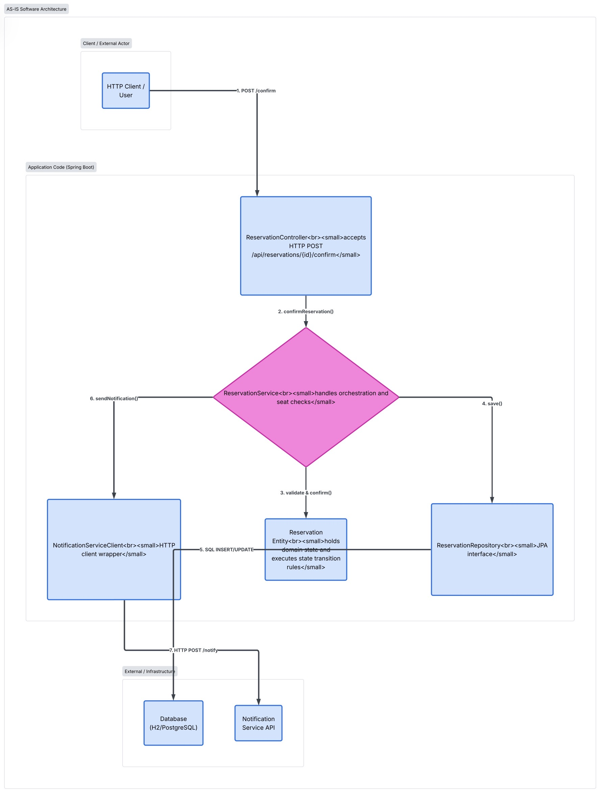

## A1. Scénář a související požadavky / pravidla

**Scénář / operace:** Confirm Reservation (`POST /reservations/{reservationId}/confirm`) 

**Požadavky:** 
- REQ-03 (Potvrzení rezervace)
- REQ-01 (Vytvoření rezervace)
- 
**Pravidla / invarianty:**
- BR-01 (Dvě potvrzené rezervace na stejné sedadlo a promítání se nesmí překrývat)
- BR-02 (Rezervaci lze potvrdit pouze ze stavu DRAFT)
- 
**Baseline:** v0.2

## A2. Mapování hlavního průchodu scénáře na kód

1. **Přijetí HTTP požadavku**:
   * **Kód**: `com.cinema.reservation.ScreeningController.confirmReservation(Long reservationId, RedirectAttributes redirectAttributes)`
   * **Popis**: Controller přijme HTTP POST požadavek na `/reservations/{reservationId}/confirm`.

2. **Načtení rezervace z databáze**:
   * **Kód**: `com.cinema.reservation.ReservationService.confirm(Long reservationId)` -> `ReservationRepository.findById(reservationId)`
   * **Popis**: Servis načte entitu `Reservation` podle ID. Pokud neexistuje, vrátí `ReservationService.Outcome` s neúspěchem.

3. **Kontrola stavu a obchodního pravidla (Invariant BR-02)**:
   * **Kód**: `com.cinema.reservation.ReservationService.confirm(Long reservationId)`
   * **Popis**: Service kontroluje, zda je aktuální stav `ReservationStatus.DRAFT`. Pokud ne, vrátí neúspěšný `ReservationService.Outcome`.

4. **Kontrola dostupnosti sedadel / překryvu (Invariant BR-01)**:
   * **Kód**: `com.cinema.reservation.ReservationService.blockedSeatIds(Long screeningId)`
   * **Popis**: Servisa ověří, zda vybraná sedadla (`ReservedSeat`) pro dané promítání (`Screening`) již nejsou blokována jinou potvrzenou rezervací.

5. **Změna stavu na CONFIRMED a perzistence**:
   * **Kód**: `com.cinema.reservation.ReservationService.allocateSeats(Reservation reservation, List<Long> requestedSeatIds)` -> `Reservation.setStatus(ReservationStatus.CONFIRMED)`
   * **Popis**: Stav rezervace je změněn na `CONFIRMED` a uložen do databáze.

6. **Odeslání notifikace (Externí závislost)**:
   * **Kód**: `—` (neimplementováno)
   * **Popis**: Notifikace po potvrzení rezervace nejsou v aktuální implementaci podporovány.

7. **Návrat odpovědi klientovi**:
   * **Kód**: `com.cinema.reservation.ScreeningController` -> `redirect:/reservations/{reservationId}`
   * **Popis**: Controller přesměruje uživatele na stránku s detailem rezervace.

## A3. Mapování doplňkové / chybové větve

**Chybová větev: Pokus o potvrzení již potvrzené nebo zrušené rezervace (Porušení BR-02)**

1. **Vstup**: Klient pošle požadavek na potvrzení rezervace, která má stav `CONFIRMED` nebo `CANCELLED`.
2. **Detekce chyby**:
   * **Kód**: `com.cinema.reservation.ReservationService.confirm(Long reservationId)`
   * **Mechanism**: Service zkontroluje `reservation.getStatus() != ReservationStatus.DRAFT` a vrátí `ReservationService.Outcome` s chybovou zprávou.
3. **Zpracování chyby**:
   * **Kód**: `com.cinema.reservation.ScreeningController.reservationRedirect(ReservationService.Outcome outcome, String successAttribute, String errorAttribute, RedirectAttributes redirectAttributes)`
   * **Výstup**: Neúspěšný výsledek je uložen jako flash atribut a uživatel je přesměrován na detail rezervace. Databáze zůstane nezměněna.

## A4. Seznam hlavních částí implementace

* **`ScreeningController`**: Server-rendered endpointy, zpracování formulářů a přesměrování.
* **`ReservationService`**: Aplikační logika a řízení transakcí pro vytváření, potvrzení, schválení, zamítnutí a zrušení rezervací.
* **`Reservation` (Domain Entity)**: Entita rezervace se stavem a požadovanými sedadly.
* **`ReservationRepository`**: Rozhraní Spring Data JPA pro perzistenci a dotazování nad entitou `Reservation`.
* **Notifikační služba**: Neimplementováno.

## A5. Stav, změna stavu a pravidlo

* **Kde je stav uložen**: Fyzicky v relaci DB tabulky `reservations` (sloupec `status`). V běžící aplikaci v doménové entitě `Reservation.status`.
* **Kdo rozhoduje o změně stavu**: `ReservationService` pomocí `Reservation.setStatus(ReservationStatus)`.
* **Kde se vynucuje business pravidlo (BR-01 / BR-02)**: 
  * Pravidlo stavového přechodu (BR-02) se vynucuje v `ReservationService.confirm(Long reservationId)`.
  * Pravidlo nepřípustnosti překryvu sedadel (BR-01) se vynucuje v `ReservationService` před změnou stavu.

## A6. Relevantní externí a perzistenční závislosti

| Závislost | Typ | Bod integrace v kódu | Použitá metoda / rozhraní |
| :--- | :--- | :--- | :--- |
| **Relační databáze (H2 / PostgreSQL)** | Perzistenční | `ReservationRepository` | Spring Data JPA (`findById`, `save`) |
| **Notification Service** | Neimplementováno | — | — |

## A7. Nakreslete AS-IS strukturální diagram

## A8. Architektonická otázka pro další návrh

> **Otázka**: Jakým způsobem zajistíme konzistenci a zabráníme race condition (souběžným požadavkům na potvrzení/rezervaci stejného sedadla na stejné promítání v jeden okamžik), pokud databázová kontrola v `ReservationService` probíhá na úrovni aplikační logiky bez použití pesimistického/optimistického zamykání nebo databázových unikátních indexů?
